# Mars Protocol v2 <!-- omit in toc -->

- [1. Vision](#1-vision)
- [2. Overview](#2-overview)
- [3. Red Bank](#3-red-bank)
  - [3.1 Collateralised Borrowing](#31-collateralised-borrowing)
  - [3.2 Interest Rate Model](#32-interest-rate-model)
  - [3.3 Contract-to-Contract (C2C) Lending](#33-contract-to-contract-c2c-lending)
  - [3.4 Red Bank Liquidation Mechanisms](#34-red-bank-liquidation-mechanisms)
- [4. Rover Credit Accounts](#4-rover-credit-accounts)
  - [4.1 Credit Account Architecture](#41-credit-account-architecture)
  - [4.2 Integrations](#42-integrations)
    - [4.2.1 Trading](#421-trading)
    - [4.2.2 Vaults](#422-vaults)
    - [4.2.3 Fields of Mars](#423-fields-of-mars)
  - [4.3 Rover Liquidation Mechanisms](#43-rover-liquidation-mechanisms)
  - [4.4 NFT Accounts](#44-nft-accounts)
- [5. Mars Hub](#5-mars-hub)
- [6. Mars Token Economics](#6-mars-token-economics)
  - [6.1 Claiming MARS](#61-claiming-mars)
  - [6.2 MARS Staking](#62-mars-staking)
  - [6.3 Value Flows](#63-value-flows)
  - [6.4 Safety Fund](#64-safety-fund)
  - [6.5 MARS Allocation and Distribution](#65-mars-allocation-and-distribution)
- [7. Governance](#7-governance)
- [8. Activation and Future](#8-activation-and-future)

**DISCLAIMER**

*This whitepaper does not constitute investment advice, does not include any promises, offers, guarantees, representations or warranties, and includes speculative forward-looking statements about potential post-launch capabilities of Mars. This whitepaper is qualified in its entirety by the project disclaimers [here](https://mars-protocol.medium.com/mars-disclaimers-disclosures-f44cc7c54a33).*

*This article is subject to change but is not guaranteed to be up to date. Mars Protocol v2 was published on September 25, 2022.*

## 1. Vision

The original vision of Mars was built on a new primitive called [Contract-To-Contract (C2C) Lending](https://mars-protocol.medium.com/a-vision-for-the-fields-of-mars-and-contract-to-contract-c2c-lending-9c6e4239f72c). This allowed whitelisted smart contracts to borrow assets from a lending pool within the Red Bank for a predefined purpose. Both collateral and borrowed assets were held by the whitelisted contract, which made them liquidatable and allowed for greater leverage and capital efficiency. 

While this provided a powerful generalised credit primitive, it was unable to facilitate cross-margin between different C2C strategies. This resulted in a sub-optimal borrower experience since users needed to post separate collateral and manage liquidation levels for each individual strategy.

Mars v2 leverages the same smart contract credit line primitive to propose a novel credit account primitive: the Rover. Users can fund a rover (represented by an NFT) via Mars' credit manager smart contract. Once funded, the user can interact with any whitelisted C2C strategy. This architecture gives users the ability to cross-collateralise different leveraged strategies into a single account with a single liquidation LTV.

Crucially, in addition to enabling cross-collateralisation between C2C strategies, rovers can also integrate with other Decentralised Finance (DeFi) primitives. This allows users to perform leveraged interactions with any whitelisted decentralised application (dApp) with a single account-level LTV. Rovers will be represented as NFTs and a wallet may hold several distinct rovers, similar to the “sub-account” experience familiar to users of centralised exchanges. 

Rovers effectively allow for a “rebundled” DeFi experience as users would be able to access their favourite tokens, farms, and protocols, using leverage, through the Mars credit account. This integrated experience represents the next evolution of DeFi, providing a user experience (UX) comparable to centralised exchanges (CEXes) on many important dimensions (such as speed, leverage, liquidation penalty, and asset choice), while gaining the potential to integrate key DeFi primitives and maintaining the advantages of decentralisation: self-custody and censorship-resistance.

This new architecture leads to significant advantages, as detailed in Fig. 1.

**
 Fig. 1: Classic C2C Lending vs. Mars v2 C2C Lending
**

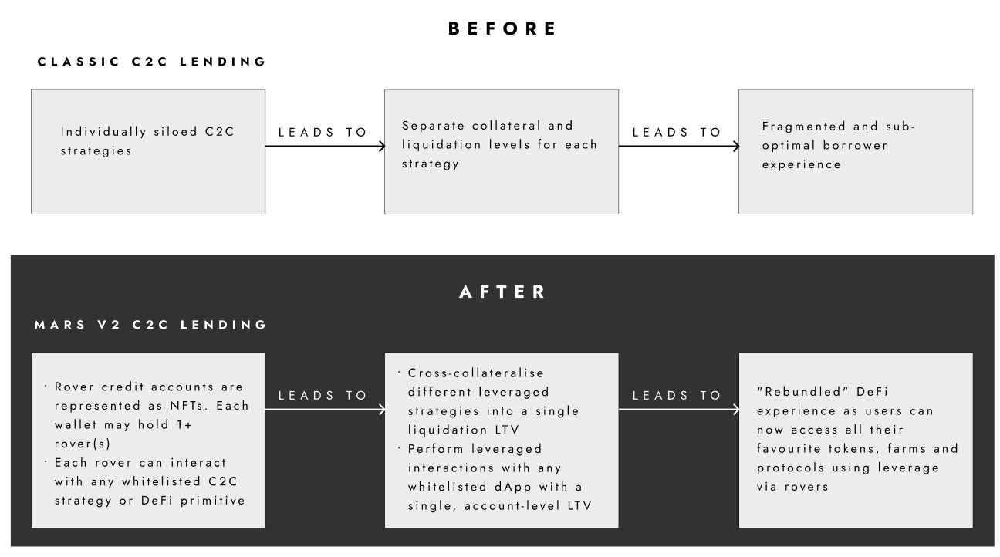

To achieve this vision, the Mars smart contracts must deploy on a highly performant, decentralised platform offering a thriving DeFi ecosystem with many potential integrations and demand for leverage. 

There are a few Cosmos chains which fulfil these requirements and have a chance of becoming an active Cosmos DeFi hub. The Red Bank should exist wherever there’s demand for liquidity, and ideally, Mars would be present on each of these chains rather than selecting a single platform and wedding its fate to it. Crucially, Mars should be present on these chains natively since a competitive DeFi experience requires atomic, synchronous composability, which cannot be achieved by cross-chain calls.

This is the rationale that underpins the Mars Hub and Outpost topology, which is illustrated below in Fig. 2. Each outpost is an integrated DeFi experience native to a specific chain which connects to the Mars Hub - a Cosmos SDK chain.<a href="#note1" id="note1ref">1</a>

Fig. 2: Mars’ “hub and spoke” architecture

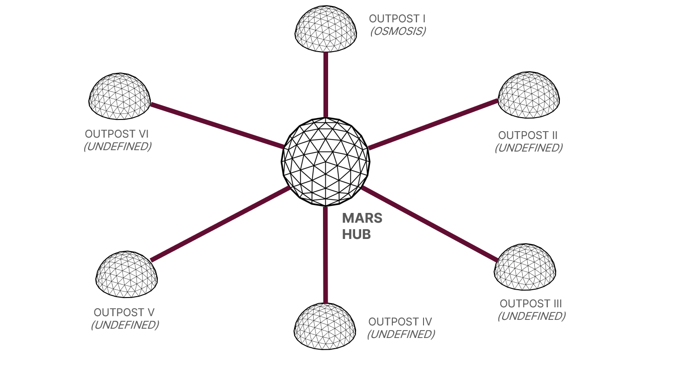

The Hub itself does not hold liquidity for outposts but rather administers activity that occurs on its outposts. Specifically, it governs all outpost smart contracts, receives fees from outposts and distributes them to participants in Mars’ governance. In this way, Mars Hub acts like a fast food franchiser: establishing standards but leaving interaction with customers to individual franchise restaurants. Similarly, traders and yield seekers who aren’t interested in governance will be unlikely to interact with the Hub. Instead, the Hub serves as a coordination mechanism in the background, while traders interact directly with the liquidity aggregated on each of the Mars outposts.

## 2. Overview

While subaccounts are quite popular on centralised exchanges, they’re not yet common in DeFi. Mars v2 changes that by offering “DeFi subaccounts.” By enabling integrations with new and existing DeFi primitives, these subaccounts should allow greater functionality than subaccounts on centralised exchanges. 

Ultimately, credit accounts act as a wrapper for numerous on-chain positions a user may have taken. That means credit accounts can be represented as a transferable NFT, which could unlock additional use cases such as copy-trading, atomic transfers, "credit scoring", fractionalisation and more, as detailed in the section on [NFT accounts](#nft-accounts). 

Fig. 3 outlines an example of the DeFi subaccount experience on Mars v2.

Fig. 3: Rover credit account user journey

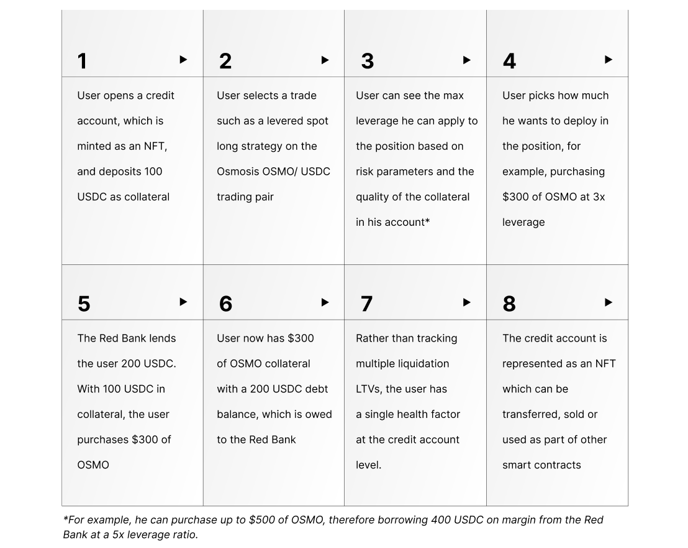

Mars Hub and its outposts work together to enable this functionality. They, in turn, are governed by the Martian Council, which is composed of MARS stakers and validators. Stakers put skin in the game by allowing their tokens to be used by validators who engage in Proof of Stake (PoS) block production/validation on Mars Hub and participate in governance in exchange for a share of the protocol revenues, which are derived in part from borrowing fees.

To manage risk, all leverage activities must be whitelisted by the Martian Council and will be assigned risk parameters that set borrowing limits for each type of activity. Independent liquidators can subsequently close any position in the event that the position exceeds its borrowing limit. Liquidations are most likely when the value of a user’s collateral falls relative to the value of their borrowed assets.

The following sections elaborate upon all of Mars v2’s components.

## 3. Red Bank
A Mars “outpost” consists of two components on any supported chain: the Red Bank and rover credit accounts. The Red Bank is a fully automated, on-chain credit facility which provides liquidity for rover credit accounts. Specifically, the Red Bank supports two types of lending: 

1. Collateralised loans directly within the Red Bank
2. Contract-to-contract (C2C) lending to whitelisted smart contracts. C2C lending powers rover credit accounts, which enable users to access leverage when interacting with core DeFi primitives.
	
Each deployment of the Red Bank for a given outpost is comprised of the following stakeholders:

- **Validators/Stakers**: Stake MARS on Mars Hub, secure the Mars Hub network, govern outposts, implement new features and set risk parameters. In return for doing so, they earn a portion of protocol revenues. 
- **Lenders**: Deposit assets into Mars liquidity pools, earning a fee analogous to an interest rate.
- **Borrowers (collateralised)**: Borrow assets from Mars liquidity pools using their deposited assets as collateral. These borrowers must, therefore, also be depositors.
- **Borrowers (contract-based)**: Smart contracts that are whitelisted to borrow assets from Mars liquidity pools without posting collateral (as the contracts themselves will hold collateral). Each smart contract must be approved by governance, with a set credit limit to mitigate the protocol’s risk exposure. These credit lines power Mars’ credit accounts, giving end users access to leverage without first requiring Red Bank deposits.
- **Liquidators**: Third parties that liquidate Red Bank positions by repaying the debt of under-collateralised users in exchange for a fee.

Fig. 4 illustrates the stakeholders and value flows in the Red Bank.

Fig. 4: Red Bank Stakeholders

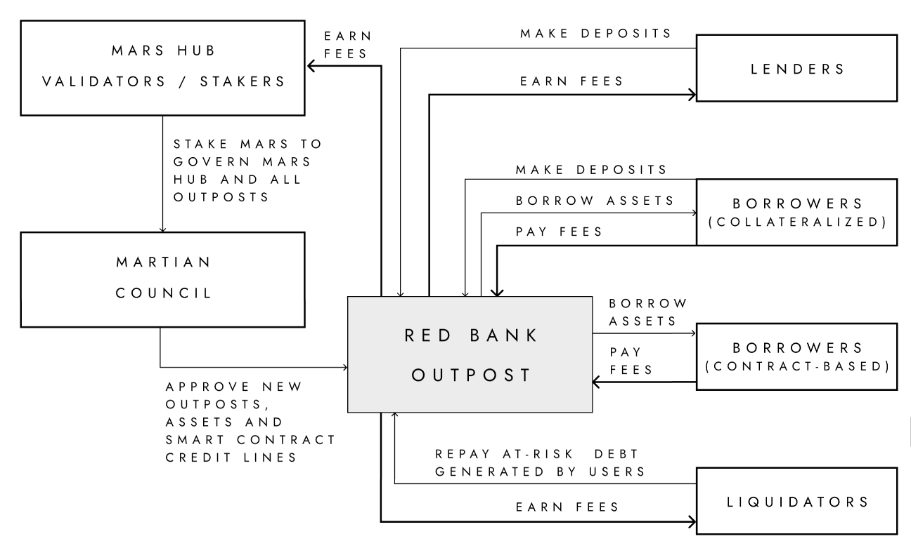

Multiple outposts can be established – all of which are coordinated by Mars Hub and governed by the Martian Council.

### 3.1 Collateralised Borrowing

Similar to existing credit protocols such as Aave or Compound, Mars is designed to support non-custodial, over-collateralised borrowing. Users who deposit assets into smart contract liquidity pools may borrow other assets listed on the Red Bank using their original deposits as collateral.

Lending thus serves two purposes: generating yield and, if the user chooses, acting as collateral to borrow against. The interest rates paid by borrowers and received by lenders are determined algorithmically, taking into account supply and demand via a utilisation rate target.

The first Red Bank outpost is expected to launch on Osmosis with borrowing and lending support for ATOM, OSMO and axlUSDC (Axelar USDC).

Since Mars is designed to be asset-agnostic — and able to support any native Cosmos asset — the community will then be able to propose further assets to be listed. To facilitate its deliberations, the Martian Council is expected to adopt an open-source framework for setting risk parameters and assessing the riskiness of specific assets.

The following figures illustrate collateralised borrowing and how loan-to-value and margin maintenance work with volatile assets.

Fig. 5: Borrowing volatile assets with stablecoin collateral

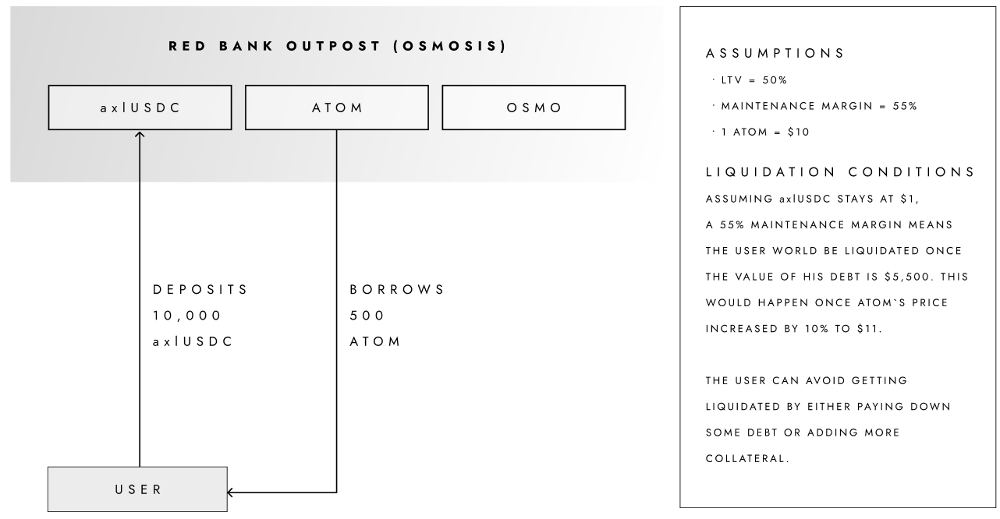

Fig. 6: Borrowing stablecoin assets with volatile collateral

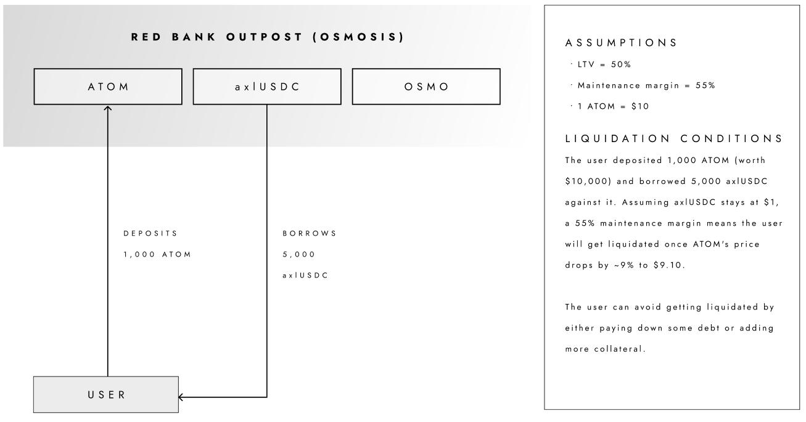

### 3.2 Interest Rate Model

The Red Bank operates with a standard two-slope interest rate model (see Fig. 7). Pioneered by [Aave](https://github.com/aave/aave-protocol/blob/master/docs/Aave_Protocol_Whitepaper_v1_0.pdf) and [Compound](https://compound.finance/documents/Compound.Whitepaper.pdf), this model is battle-tested and widely used throughout DeFi. It works by targeting a certain utilisation rate (amount borrowed / amount deposited). Then, a curve is derived and implemented that aims to discourage utilisation past the optimal level by a sharply increasing slope, i.e. a sharply increasing interest rate.

Fig. 7: Mars’ two-slope interest rate model

These parameters reflect the perceived riskiness of the asset in question and is determined by the Martian Council using the asset listing risk framework.

### 3.3 Contract-to-Contract (C2C) Lending

Contract-to-contract (C2C) lending taps into a completely new source of borrowing demand for credit protocols: non-depositor borrowers (i.e., third-party smart contracts). This additional source of demand can lead to a significantly more competitive credit protocol, since it can create a virtuous cycle in which higher borrowing demand (from this new source) leads to higher utilisation rates, which leads to more deposits and so on. C2C loans power Mars' credit accounts, enabling leveraged yield farming in the Fields of Mars and later use cases which give users the ability to leverage their positions on any chain that has an outpost.

It’s important to realise that C2C loans, despite being distinguished from “collateralised” loans in this whitepaper, are not uncollateralised per se. While the smart contract receiving the loan doesn’t need to deposit collateral on the Red Bank in order to receive the loan (unlike regular users), mechanisms to ensure solvency must be implemented. Collateral is always required from the end user and is held by the C2C lending contracts, which are able to track the collateral's value and liquidate it if the position becomes unhealthy. In this sense, collateralisation happens at the borrowing contract level rather than at the Red Bank level, as it’s the borrowing contract that receives the loan.

In order for collateralisation at the borrowing contract level to matter, it needs to be accompanied by a sound liquidation engine. As such, borrowing contracts that wish to utilise C2C borrowing, including the credit accounts described in Section 4, must have liquidation logic implemented that ensures their ability to repay the debt regardless of market conditions. Developers are free to choose their preferred logic and parameters, but these must be approved by the Martian Council in order for C2C “credit lines” to be extended.

### 3.4 Red Bank Liquidation Mechanisms

In order to avoid insolvencies, the Red Bank offers incentives to liquidators to repay the debt of at-risk positions. Within the Red Bank, the health of a position (the level of collateralisation) is expressed in the health factor (HF) formula. This formula determines if an active account is healthy (overcollateralised) and consequently can be sustained, or at risk (undercollateralised) and consequently needs to be liquidated.

A Liquidation LTV parameter is determined by the Max LTV of an asset. This Max LTV is used to appropriately weight the contribution of each asset as collateral in the account. If a specific account has borrowed more than the adjusted collateral value of all its assets (as determined by their liquidation LTV), then the account will have a HF <1 and can be liquidated.

Liquidation LTV (LT) = Max LTV + Safety Cushion

The Health Factor formula is a simple ratio of the sum of adjusted assets by their Max LTVs over the amount borrowed in the account.

Where:

$c_{i}$ = Position size of the $i-th$ asset in the account.

$p_{i}$ = Price of the $i-th$ asset in the account.

$LT_{i}$ = Liquidation LTV for the $i-th$ asset in the account.

$b_{k}$ = Borrow size of a $k-th$ liability in the account.

$p_{k}$ = Price of a $k-th$ liability in the account.

When the health factor of any position falls below 1, it is deemed undercollateralised and becomes liquidatable. When a position becomes liquidatable, any user can repay the debt of the position (up to a limit called the close factor) to receive a portion of the collateral and a bonus.

Liquidations follow a multi-step process:

1. A third-party liquidator uses on-chain data to identify an account that has a health factor below 1.
2. This liquidator identifies a debt asset they wish to pay back on behalf of an account.
3. This liquidator also identifies the collateral asset they wish to receive.
4. The liquidator pays back an arbitrary amount of the user’s debt, up to the close factor (i.e. if the close factor is 50%, the liquidator can only repay up to 50% of the user’s debt in a single liquidation transaction).
5. The liquidator receives a portion of the user’s collateral equal to the debt repaid and a liquidation bonus (i.e. if the liquidation bonus of the given collateral asset is 10% and the liquidator repaid an equivalent of $100 USD of the user’s debt, the liquidator would receive $110 USD worth of the user’s collateral)

Consider the following liquidation example. 

First, a user deposits and borrows from a Red Bank outpost. Over time, the value of their deposit falls. This pushes their health factor below 1 and makes the account eligible for liquidation, as shown  in Fig. 8.

Fig. 8: Liquidation flow, Part 1

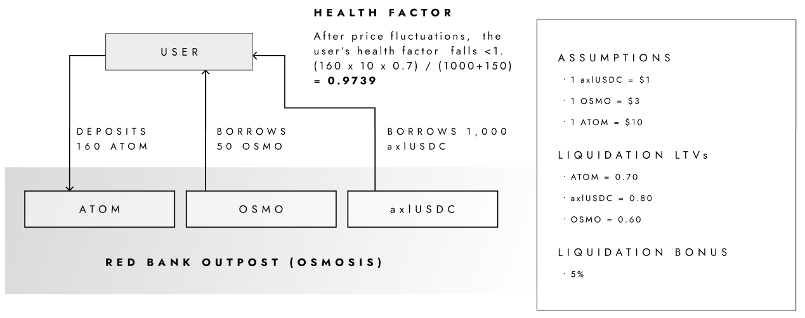

A liquidator then identifies the account, pays off a portion of the debt, and receives a 5% liquidation bonus. The user retains a portion of their debt plus their original deposit(s) minus the liquidation bonus, as shown in Fig. 9.

Fig. 9: Liquidation flow, Part 2

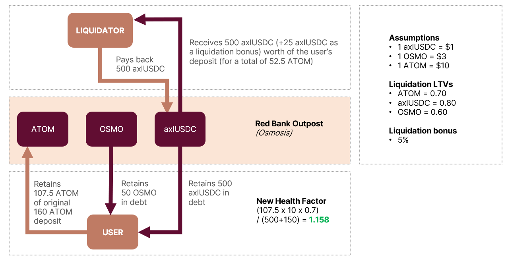

## 4. Rover Credit Accounts

Today’s lending protocols primarily rely on over-collateralisation of borrowers’ assets. This severely limits the capital efficiency and market size of a DeFi ecosystem. By moving beyond the requirement for borrowers to also be lenders, more assets can be pooled and deployed to productive uses and new credit use cases such as decentralised margin trading and leveraged liquidity provisioning can flourish.

This whitepaper proposes a new primitive based on Mars v2’s generalised leverage module: the Rover. Rover credit accounts enable users to trade and farm with leverage across DeFi strategies & protocols all in one account with a health factor and cross-collateralised assets. Users can draw leverage by borrowing from the Mars Red Bank in their credit account and use it to interact with governance-whitelisted external contracts.

Credit accounts hold a user’s assets and compute a health factor based on the value and riskiness of the user’s positions, as determined by on-chain data and the Martian Council, respectively. In a similar vein to the Red Bank, if this health factor drops below the minimum threshold, a liquidation engine incentivises third parties to repay the debt and keep the system solvent. Mars v2 designs limit the credit account, which is represented by an NFT, to interact only with whitelisted contracts in order to avoid users exfiltrating borrowed funds.

One can think of the credit account as an escrow agent. This agent is a neutral party responsible for holding funds for two or more parties. The agent receives instructions valid only for specific, predefined actions.

Similarly, credit accounts hold lender and borrower funds on an instance of a smart contract. This contract can execute whitelisted operations but doesn’t grant users direct access to the underlying funds. The whitelist is composed of both collateral tokens and contracts where funds can be deployed.

Through this mechanism, users access higher leverage and use this leverage across a variety of DeFi protocols. They only need to track a single liquidation LTV at the credit-account level, regardless of the number of positions the funds are deployed in.

A user can have one or several credit accounts, each of which are represented as an NFT. NFT accounts open up an exciting world of possibilities, which are explored below.

### 4.1 Credit Account Architecture 

The architecture is modular and extensible, allowing new protocols and integrations to be added easily, as shown in Fig. 10. 

Fig. 10: Credit account architecture

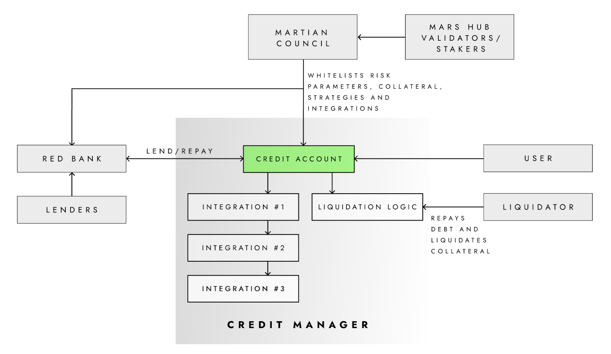

### 4.2 Integrations 

Leverage account primitives specify which token(s) and smart contract(s) are whitelisted by Mars v2’s Credit Manager module. Integrations should give lenders confidence that their funds won’t be exfiltrated by borrowers. Therefore, it’s important that Mars governance works to guarantee that only robust and safe integrations are approved.

Integrations may offer their own incentives for borrowers to direct leverage toward their protocols thereby increasing their own TVL and fee income.

In general, integrations can be broken down into two categories: 

1. Trading (including leveraged trading).
2. Yield-seeking activities including vaults and leveraged yield farming in the Fields of Mars.

The following sections explore these integration types.

#### 4.2.1 Trading

Mars is designed to enable spot and leveraged trading of specific assets on its outposts when approved by governance. Trading (and leveraged trading) will work differently for specific types of trades as explained in the subsections below.

*Non-leveraged trading*

- Simple (non-leveraged) trades within a credit account will resemble typical DEX trades. A user will be able to select one asset to swap for another, and the credit account will facilitate this transaction.

*Leveraged shorts*

- To enable leveraged shorts, the asset must already be borrowable in the Red Bank. Assets that are not yet borrowable can be added via standard governance procedures (more below).
- Once an asset is borrowable in the Red Bank and approved for leveraged shorting, the user could then select the asset they’d like to short and the asset to short it against. Specifically, the short transaction involves borrowing an asset from Mars and selling it for another asset they’re willing to hold for the duration of the short. The credit account will atomically and seamlessly swap the assets behind the scenes.
- As with every other activity supported by credit accounts, the user will be able to short assets using leverage. This ultimately means that the user will be able to short a higher value asset than the sum value of the user’s deposited collateral as long as their HF is >1.

*Leveraged longs*

- For leveraged longs, the user will be able to select an asset to borrow from the Red Bank (typically a stablecoin) and an asset to long. Behind the scenes, the credit account will automatically borrow stablecoins from the Red Bank and swap them for the desired asset.

*Hypothetical trading examples within a credit account*

Imagine a hypothetical trader who sees a market opportunity to short ATOM, which is trading at $10. The trader sells 100 ATOM on margin against axlUSDC, borrowing against his collateral in the process. On the backend, the credit account borrows 100 ATOM from the Red Bank and swaps it for 1,000 axlUSDC. The trader’s total debt is now 100 ATOM. Fig. 11 shows two hypothetical outcomes from this trade.

Fig. 11: Short selling example within a credit account

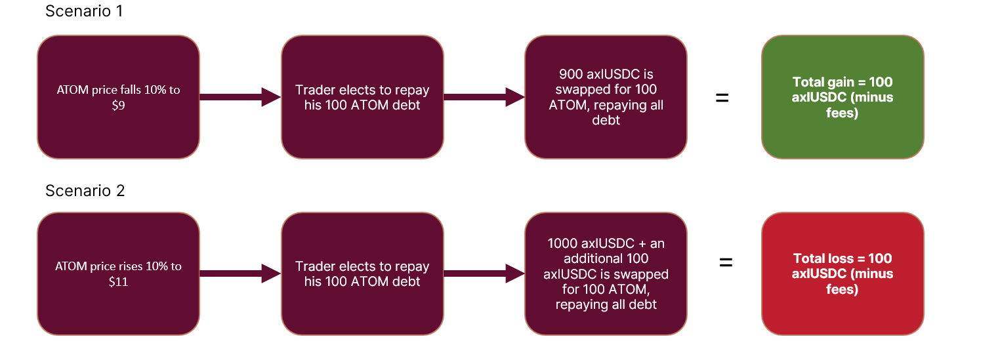

Now, imagine a hypothetical trader who sees a market opportunity to long ATOM, which is trading at $10. The trader buys 200 ATOM on margin by borrowing axlUSDC against his collateral. On the backend, the credit account borrows 2,000 axlUSDC from the Red Bank and swaps it for 200 ATOM. The trader’s total debt is now 2,000 axlUSDC. Fig. 12 shows two hypothetical outcomes from this trade.

Fig. 12: Leveraged long example within a credit account

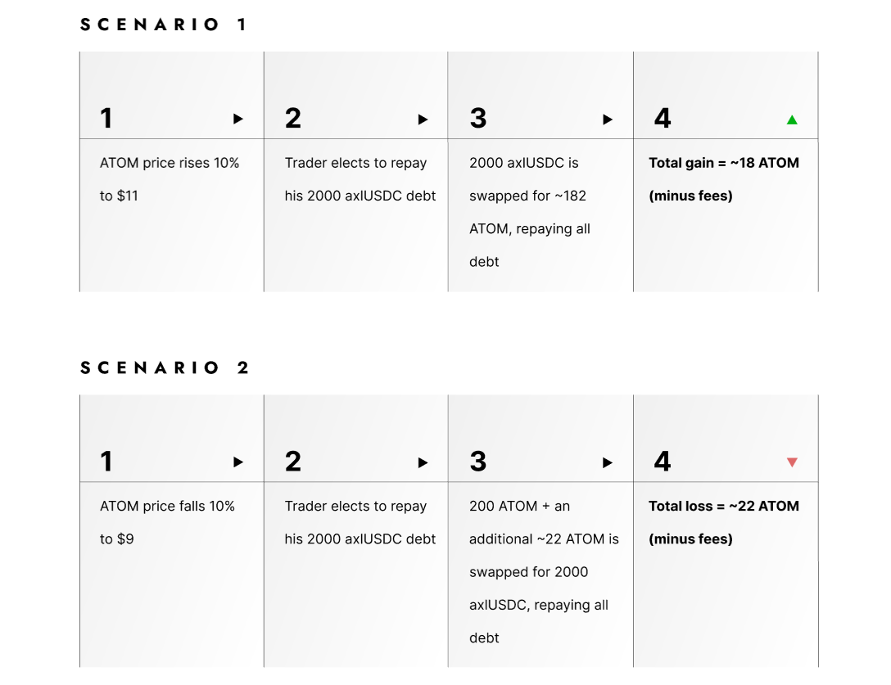

Ultimately, governance will be responsible for the scope and robustness of trading activity on Mars. Specifically, governance will be able to determine the following criteria:

1. The underlying DEXs that are whitelisted for trading. 
2. The assets that are borrowable on the Red Bank. As mentioned above, this determines the list of assets available to be shorted and, in the case of stablecoins, allows for assets to be longed.
3. The risk parameters of assets added to the Red Bank: these ultimately determine the leverage a user can take on a given position.

Fig. 13 shows how the process for whitelisting a DEX or adding an asset to the Red Bank works.

Fig. 13: Adding support for spot and leveraged assets on Mars v2

#### 4.2.2 Vaults

Vaults are the container for assets implementing automated strategies, which generate yield. They offer auto-compounded yield generation capabilities on any supported chain. Written by third parties and approved for integration with Mars by the Martian Council, users can deposit assets into these vaults to participate in the automated yield generation strategies. Strategies could include:

- Yield farming governance tokens
- Liquidity provisioning on AMMs
- Other advanced features such as automated trading, options strategies, etc.

At any time, third parties can author or propose new vault strategies with custom risk parameters for Mars. If approved by governance, these strategies will be deployed and incorporated into Mars’ credit accounts, so they can be used as collateral for other activities. Each credit account will also support multiple cross-collateralised vault positions. The first vault strategies are leveraged yield farming, which will be supported by the Fields of Mars.

####  4.2.3 Fields of Mars

In the Fields of Mars users can leverage yield farm vault positions by using rover credit accounts.

Initially, each deposit into a Fields vault creates a credit account with a single position. Fig. 14 shows, at a high level, how deposits work with the OSMO-ATOM strategy, resulting in an effective 2x leverage ratio for the user.

Fig. 14: A leveraged yield farming position in the Fields of Mars

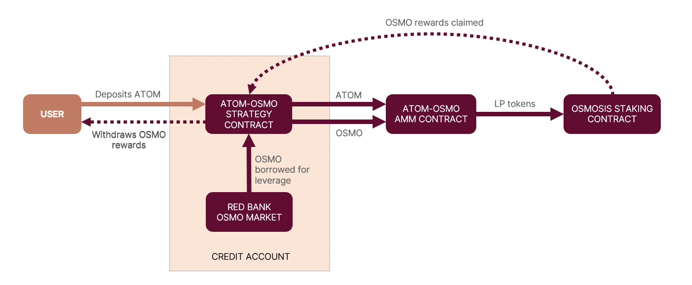

This allows the user to farm with leverage with increased yield (in the form of OSMO tokens issued as bonding rewards). However, should the value of OSMO drop, the risk of liquidation is increased. Both scenarios are illustrated below.

In scenario 1 (Fig. 15), the user supplies ATOM and borrows OSMO from the Red Bank's OSMO pool. The ATOM and OSMO are deposited in the ATOM-OSMO LP pool and staked in the Osmosis staking contract. As long as the yield in fees and OSMO rewards exceeds the interest rate, the user's profit will increase faster than borrowing costs.

Fig. 15: Value of LP asset remains constant or increases

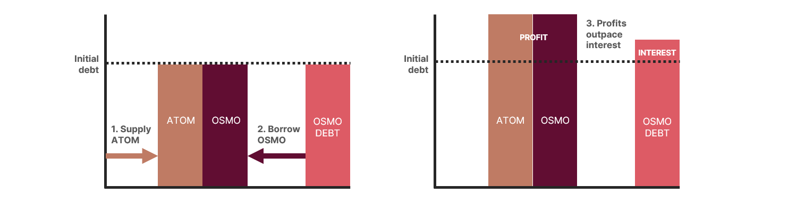

In Scenario 2 (see Fig. 16), the ATOM-OSMO LP share is held as collateral by the smart contract and the value of the collateral and debt is tracked over time (using the AMM itself as the oracle). If the ratio of debt to collateral exceeds a certain level defined in the smart contract (i.e. the margin requirement), the LP share is liquidated to pay back the debt.

Fig. 16: Value of LP asset decreases, resulting in liquidation

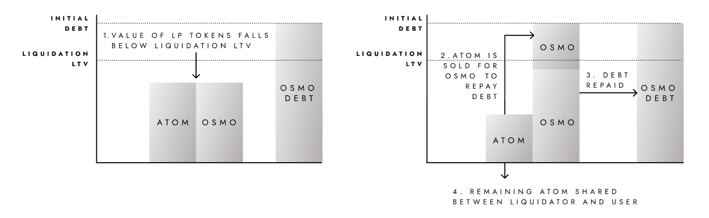

### 4.3 Rover Liquidation Mechanisms

The Credit Manager module is responsible for tracking the health of each credit account and ensuring that accounts at risk are liquidated promptly in order to avoid the accumulation of bad debt.

Mars governance should strive for whitelisting only robust assets and strategies such that liquidations can always be performed in an orderly manner and insolvencies are mitigated. Mars contributors expect to release an open-source framework designed to help assess the riskiness of assets and protocols. While this framework is non-binding, it can be used by governance to ensure the Martian Council is approving appropriate assets, strategies and risk parameters.

When and if an asset passes the whitelisting process, it will be assigned a Liquidation LTV. Liquidation LTVs are used to calculate a Health Factor (HF) for each credit account. A HF determines if the risk-adjusted value of the total positions in a credit account exceeds the total amount borrowed in the account and is represented in the form of a ratio. If the HF drops below 1, the account is deemed at risk and is available to be liquidated. Note that a health factor below 1 does not necessarily mean that the credit account is insolvent, but rather that it has exceeded its Liquidation LTV and may be approaching insolvency.

Since HFs apply to all assets in a given rover credit account, all of the user’s collateral becomes eligible for liquidation. Liquidators could receive back a diverse range of tokens (i.e. axlUSDC, OSMO and ATOM). The liquidation mechanism in rover credit accounts mirrors the process outlined in the section on [Red Bank Liquidation Mechanisms](#red-bank-liquidation-mechanisms).

Note that liquidations occur inside the liquidator’s credit account. Any liquidated assets are sent directly to the liquidator’s rover rather than the user’s wallet. Because liquidators must use the credit manager to initiate a liquidation, they can borrow the funds required to pay down Red Bank debt. This is possible because the transactions can be completed in a single transaction. Specifically, a liquidator can borrow the debt asset, swap the collateral asset back to the debt asset and repay the Red Bank all at once. In this way, credit accounts enable a flash-loan like mechanism to facilitate liquidations. 

### 4.4 NFT Accounts

Credit accounts will be represented as NFTs, opening up a range of potential use cases including:

- **Identity**: Credit accounts could expose on-chain net worth, health factor, and P&L, giving them the potential to contribute to on-chain identity and enabling social features such as leaderboards, ‘whale-watching’, copy-trading, etc. 
- **Transfer/Sale**: Users could sell or transfer their credit account to another user, including all positions within it.
- **Fractionalisation**: Users could fractionalise their credit account into fungible pieces and sell or distribute them. Provided appropriate governance controls are put in place, this could allow other users to effectively own a share of a given user’s trading activity and a secondary marketplace could be created for these fractionalised shares.
- **Collect**: Credit accounts representing legendary trades/traders could emerge as on-chain artifacts owned by collectors.
- **On-chain behaviour and competence**: Could be tracked for credit scoring.

## 5. Mars Hub

The Mars v2 vision requires smart contract code deployments across numerous blockchains. A new Cosmos-SDK Layer 1 (L1) appchain, dubbed Mars Hub, will coordinate and govern these deployments. As its name implies, Mars Hub will be the central or organising “hub” in a “hub and spoke” design. Other L1 chains that Mars Hub interacts with operate as “spokes.” 

Each spoke will be home to an Outpost consisting of the Red Bank and rover credit account contracts. All governance decisions impacting Mars outposts and Mars Hub itself will be made by governance – specifically, MARS token holders who have staked tokens on Mars Hub (see Fig. 17). 

This unique architecture enables:

1. The operation of Mars outposts on multiple blockchains
2. A neutral location (specifically, Mars Hub) for cross-chain governance and treasury
3. A source of truth for MARS tokens
4. Staking reward distributions

Fig. 17: Mars’ “hub and spoke” topology

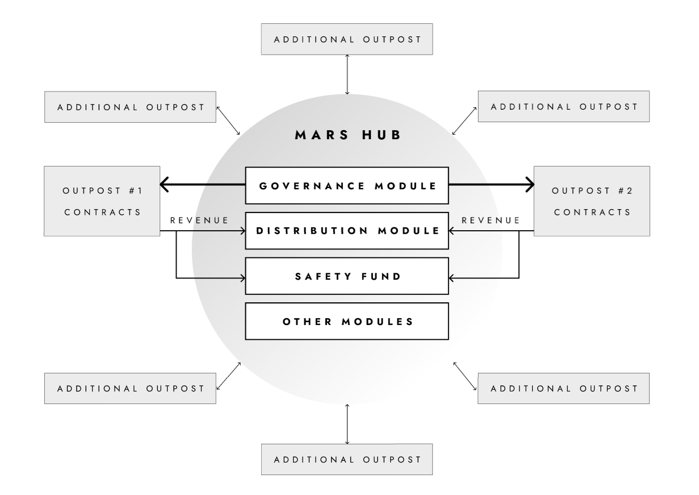

This flexible, multi-chain strategy is not reliant upon any non-Mars Hub blockchain as a home base for governance, and it will allow Mars v2 to support a wide range of blockchains in the future.

**Running Smart Contracts on Mars Hub**

Built on Cosmos SDK, v0.45, Mars Hub is expected to launch with support for CosmWasm smart contracts written in Rust. The smart contract virtual machine (VM) is implemented as a portable module that can be plugged into any blockchain built using the Cosmos SDK. This will allow Mars Hub to facilitate the MARS token claim procedure and token vesting schedule for its builders. CW3 multisig contracts and relevant frontend webapps, including Apollo Safe’s multisig frontend, are also expected to be deployed onto Mars Hub.

Mars Hub’s design features a permissioned version of the WASM module, where deployment and migration of smart contracts require approval by the Martian Council.

**Validators** 

Validators will be required to produce blocks for Mars Hub. Mars Hub’s design calls for a PoS consensus mechanism native to the Cosmos SDK v0.45. This includes a permissionless validator set, which is open to participation by any entity.

Mars Hub is expected to use the validator infrastructure native to the Cosmos SDK v0.45 with slight modifications to the incentives module as noted below in “Bespoke Modules at Launch.” A testnet, testnet faucet and testnet MARS are expected to be publicly available.

Validator participation on the Mars Hub testnet and mainnet is encouraged. A validator onboarding document available to the community prior to the launches of the testnet and mainnet is expected to be accessible at [docs.marsprotocol.io](https://docs.marsprotocol.io/mars-protocol/).

**Bespoke Modules at launch**

Appchains using the Cosmos SDK are constructed by aggregating the configurable and interoperable modules listed [here](https://docs.cosmos.network/main/modules/). Mars Hub is designed with three additional custom modules:

1. `Customgov`: A wrapper module around the [vanilla governance](https://docs.cosmos.network/main/modules/gov/) module that comes as standard within the Cosmos SDK. This wrapper inherits most of the standard governance module but implements alternative vote tallying logic. That is, tokens locked in a vesting contract contribute towards that token-holders’ voting power. This module has been built to account for the builders’ token allocation and to facilitate their participation in governance.
2. `Incentives`: A module that facilitates the incentivisation of staking on Mars Hub. Incentivisation is defined via linear unlocking schedules. Tokens associated with a schedule are sourced from the community pool and therefore incentives can only be launched after a successful governance action. It should be noted that a schedule can consist of multiple tokens, not only MARS.
3. `Safetyfund`: A module tasked solely with receiving a fraction of an outpost’s revenues denominated in stablecoins. See the section “Safety Fund”, below, for a breakdown in the use of the outpost’s revenue. Spending the funds in the safetyfund can only be done so via a successful governance proposal.

## 6. Mars Token Economics 

Helping coordinate and align incentives of the different stakeholders involved, the MARS token is a key piece of the Mars ecosystem. This section explores how the token is designed to be used within the Mars ecosystem and distributed over time.

### 6.1 Claiming MARS

MARS tokens were initially minted on what is now referred to as the Terra Classic blockchain. MARS holders as of two Terra Classic snapshot dates will be eligible to claim newly-minted MARS tokens on Mars Hub. Snapshot details as well as the planned MARS distribution can be reviewed [here](https://mars-protocol.medium.com/unveiling-the-mars-airdrop-and-snapshot-data-ea4f3926f2ca).

Details on the token claim process are expected to be announced closer to the launch of mainnet. After a user has submitted a successful claim for their tokens, the tokens will be airdropped to their new MARS address and accessible via a Keplr wallet.

### 6.2 MARS Staking

In Mars v1, MARS stakers were responsible for governing the protocol and backstopping it in the event of a shortfall event. Staked tokens were represented by xMARS, a transferable liquid staking token.

Within Mars' new architecture, MARS stakers secure the Mars Hub network, govern outpost features and risk parameters and, in return for doing so, they earn protocol fees. Staked MARS will not be represented by a transferable liquid staking token or used to backstop the protocol (more on that below).

The token’s utility will mainly materialise via delegation. Specifically, MARS holders will be able to stake (or delegate) their tokens to a number of validators within the network in order to:

1. **Secure the chain**: All else being equal, the more tokens staked within the network, the more secure the chain as it becomes more expensive to attack. As a result, by delegating MARS tokens to a validator, users will help secure the chain.
2. **Access delegated governance**: When staking tokens with a particular validator, users are delegating the voting power of their tokens to that validator. In this sense, delegation allows users to participate in governance by staking their tokens with (and thereby increasing the voting power of) validators who align with their views. A user can passively allow a validator to vote on their behalf or they can actively participate in votes themselves.  
3. **Receive fees**: In return for securing the chain, a share of protocol fees will flow to validators and their delegators. Note that the share that flows to delegators depends on the specific commission charged by each validator. Specific details are provided in the next section, “Value Flows”.

### 6.3 Value Flows

At launch, 80% of all “interest” payments will flow to Red Bank lenders (depositors), and the remaining 20% will be split equally between the Safety Fund (described in the next section) and Mars Hub stakers (less a commission to validators, if applicable) (see Fig. 18). All interest payments sent to the Safety Fund are first swapped to Axelar USDC (axlUSDC) by a rewards collector contract and transferred to Mars Hub. Interest payments for Mars Hub validators are swapped to MARS and sent to the Mars Hub distribution module, which splits it between validators and delegators per the validator’s commission rates.

Fig. 18: Value flows

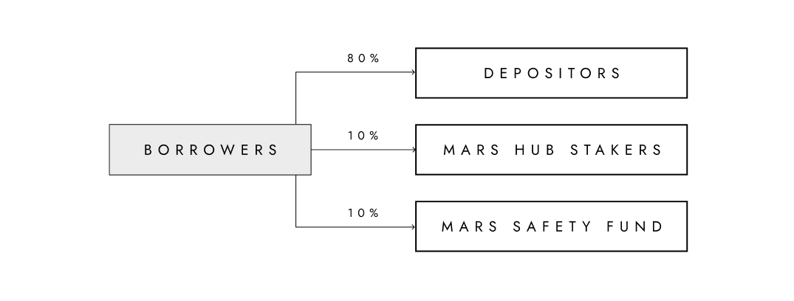

*Note that the share of fees, the asset they’re denominated in and the fee recipient groups are parameters that can be adjusted by Mars governance.*

### 6.4 Safety Fund

Shortfall events happen whenever the value of a borrower’s debt exceeds the value of the borrower’s collateral. This deficit is distinct from an illiquidity event, where utilisation rates are at 100% and lenders are temporarily unable to withdraw their deposits. In the latter case, the protocol is illiquid but solvent, whereas in a shortfall event the protocol is actually insolvent.

Shortfall events can be caused by various risks such as smart contract exploits, untimely liquidations, and/or oracle attacks. To be clear, they should not happen under normal conditions and can be mitigated by proper risk management. However, if a shortfall event does occur, Mars includes a backstop intended to limit losses. This backstop mechanism differs from the backstops in Mars v1.

Specifically, Mars v1 relied upon a pool of reserved aUST (the “Safety Fund”) as a first-resort source of recovery for shortfall events and staked Mars (the “Safety Module”) as a last-resort source of recovery, with up to 30% of any staked position being locked and sold in case of a shortfall event. 

Mars v2 will feature a Safety Fund, but will not launch with a Safety Module as the staking model on Mars v2 is significantly more complicated and provides chain security. The Safety Fund will continuously receive a share of protocol fees (10% of total) from launch. Fees will be converted to axlUSDC and reserved in the Safety Fund pool. Governance could vote to compensate users affected by a shortfall via this fund. Governance could also modify the portion of fees allocated to the Safety Fund.

Ultimately, however, compensation cannot be guaranteed and is subject to the discretion of Mars governance. Based on the relevant incentives, though, Mars governance is expected to treat the Safety Fund as a coverage source of first resort. 

### 6.5 MARS Allocation and Distribution

Fig. 19: MARS token distribution

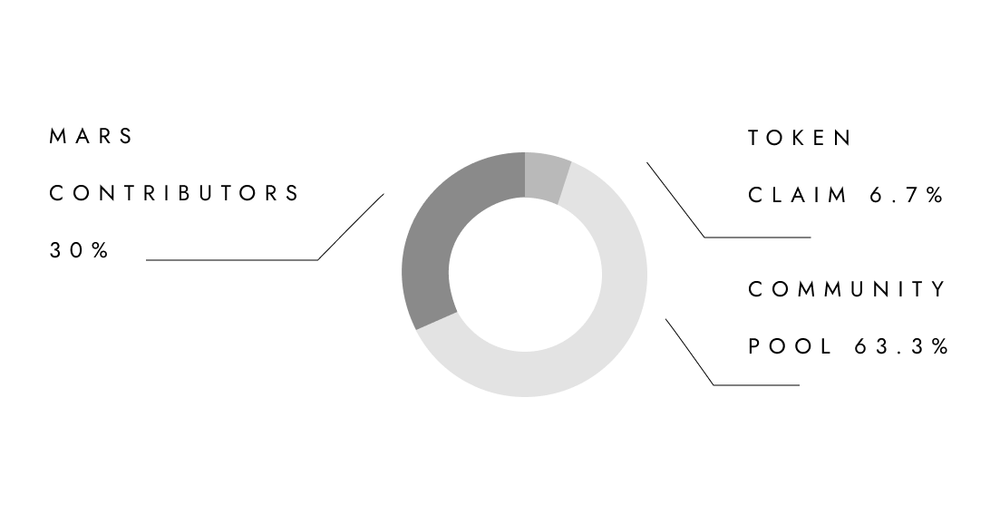

The maximum supply of MARS tokens will be 1 billion and the final token allocation is as follows: 

- **Token Claim (64.4M)**: To be distributed to all MARS token holders on Terra Classic as described [here](https://mars-protocol.medium.com/unveiling-the-mars-airdrop-and-snapshot-data-ea4f3926f2ca). These tokens will be fully unlocked and claimable upon genesis.
- **Community Pool (635.6M)**: To be distributed at the discretion of the community. Some of the use cases of this pool of funds could include incentivisation of staking/lending/borrowing, token grants and other community building programs.
- **Mars Contributors (300M)**: Subject to transferability restrictions for up to three years.

## 7. Governance

The Martian Council — a DAO of MARS stakers and their delegators — will govern whichever deployed instance of the Mars Protocol smart contract system which is embraced by the community as the canonical “Mars,” and its outposts on other chains. 

When staking tokens with a particular validator, users are delegating the voting power of their tokens to that validator. In this sense, delegation allows users to indirectly participate in governance by staking their tokens with (and thereby increasing the voting power of) validators who align with their views. If they choose, delegators can actively vote and/or create proposals with their delegated tokens. If a delegator participates in a vote, it overrides their validator’s vote.

All governance actions occur on Mars Hub. This includes everything from proposing changes, listing assets on individual outposts, whitelisting DeFi activities in credit accounts, and requesting an allocation of MARS from the community pool. Anyone can create a proposal regardless of whether they’re a validator or staker. Participating voters must have been active validators or delegators at least 1 block before the proposal was created. All voters should approach these decisions thoughtfully as they may have consequences on third parties (users) and, in extreme cases, can lead to Shortfall Events.

Governance decisions that impact Mars Hub are binding. Governance decisions impacting other chains will rely upon signal voting at launch. For Mars Hub to realise the full potential of cross-chain governance, it will need to utilise Cosmos’ Interchain Accounts (ICA). Launched in February 2022, ICA technology in its infancy. Once Cosmos’ cross-chain governance architecture is ready for binding implementations, Mars contributors will propose integrating it with the protocol.

*Note: Mars is merely software designed to create certain incentives on the part of MARS holders. Governance is ultimately a discretionary process subject to numerous uncertainties, and no specific governance outcomes can be guaranteed.*

*For example, if the Martian Council authorises a C2C credit line which functions as intended and delivers fees, the Martian Council will be rewarded for this effort through a pro rata share of a portion of the increased fees paid to Mars.*

*On the other hand, if the Martian Council suffers from a governance failure which causes losses to users, MARS stakers should be incentivised to compensate users in order to maintain Mars’ usage levels and thus preserve the value of their staked MARS. However, there is no guarantee that they will do so.*

## 8. Activation and Future

Mars v2 will be enabled in phases as its components are heavily interdependent. Each phase (see Fig. 20) builds upon the previous phase(s) until the full activation of rovers and Mars v2.

Fig. 20: Mars v2’s phased rollout

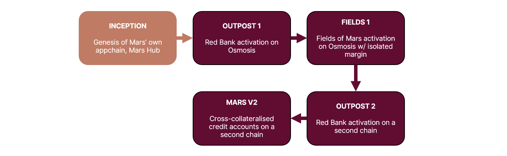

Note that Osmosis-based credit accounts will not initially support cross-collateralised strategies in the Fields of Mars. Instead, each credit account will feature isolated margin for each approved leveraged yield farming strategy. This means that users who open multiple leveraged yield farming positions will have multiple rover credit accounts on Osmosis. After launch, governance can activate cross-collateralisation within a single rover as liquidity matures on Osmosis. Chains with established liquidity are expected to support cross-collateralised rover credit accounts upon activation. These progressive activations are subject to change. As a decentralised project, anyone can permissionlessly contribute to Mars Protocol’s development by making a proposal to the DAO. This participation is encouraged.

To realise its vision as a vertically-integrated DeFi suite, the Mars community should launch additional outposts on all other significant chains. That requires a network of active and knowledgeable contributors who are eager to innovate in a rapidly-changing field.

Because Mars Hub operates on its own appchain and its architecture allows efficient communication between the hub and its spokes, it opens up new possibilities that extend beyond the scope of Mars v2. Some areas that are particularly exciting and could warrant future exploration by the Mars community include:

- **Cross-chain collateralisation**: While activity in rover credit accounts and Red Bank outposts will initially be siloed on each chain, Mars Hub could theoretically be used to coordinate cross-chain collateral and activity. For example: deposit on Chain A, use it as collateral to borrow on Chain B.
- **Cross-chain liquidity**: Mars’ “hub and spoke” architecture could enable cross-chain communication to mitigate liquidity fragmentation. With Mars providing atomic execution on each native chain, it could act as a single liquidity network that dynamically reshuffles liquidity to satisfy demand on each outpost.
- **Backstop mechanisms**: Mars v1 used staked MARS tokens as a backstop mechanism beyond the Safety Fund. Under the Mars v2 architecture, staked MARS is not used to backstop protocol insolvency but rather to coordinate governance and to secure the Mars Hub chain. However, using staked MARS as a potential backstop is an exciting design space that we encourage the community to research and explore. A well thought out proposal could allow Mars to innovate and offer higher security guarantees to its users.
- **Automated Safety Fund**: The `safetyfund` module could potentially detect cases of outpost insolvency automatically and immediately deploy funds to neutralise that imbalance. This could bypass the need for time-consuming governance proposals and help eliminate cascading funding problems.

It is hoped the vision described here inspires teams throughout the cosmos to contribute to Mars. The protocol puts an emphasis on usability, composability and capital efficiency, so DeFi can surpass offerings on centralised exchanges and provide trading tools for sophisticated users seeking to maximise returns with leverage.

Your rover awaits.

🔴

**Footnotes**

<a id="note1" href="#note1ref">1</a> See, [Finding a Home for Labs](https://members.delphidigital.io/reports/finding-a-home-for-labs) for meditations on Cosmos’ advantages

**DISCLAIMER**

*Remember, Cosmos and Mars are experimental technologies. This whitepaper does not constitute investment advice and is subject to and limited by the [Mars disclaimers](https://mars-protocol.medium.com/mars-disclaimers-disclosures-f44cc7c54a33), which you should review before interacting with the protocol.*
